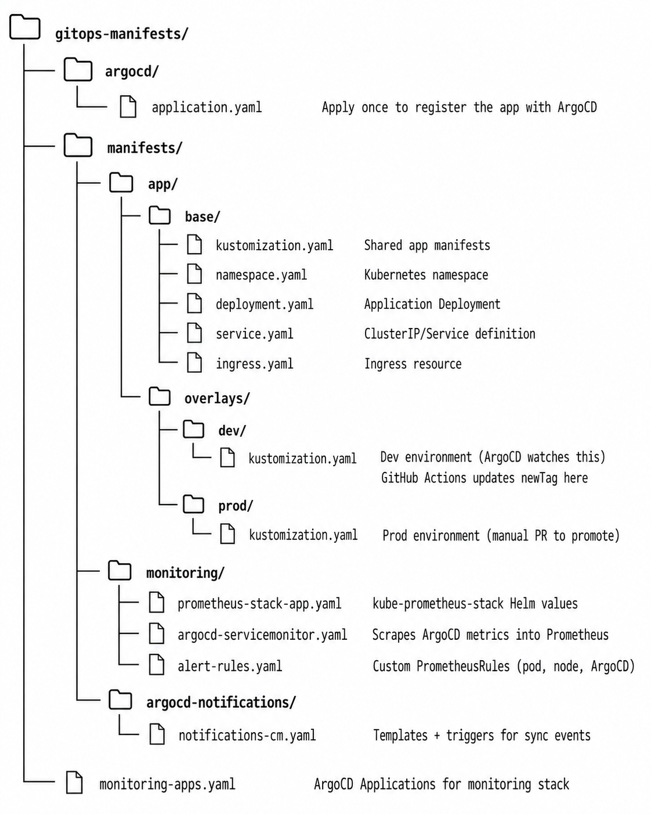
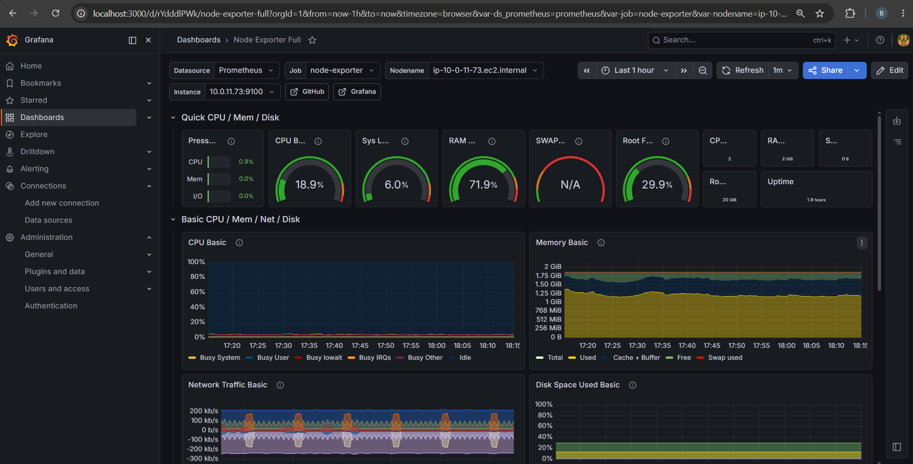
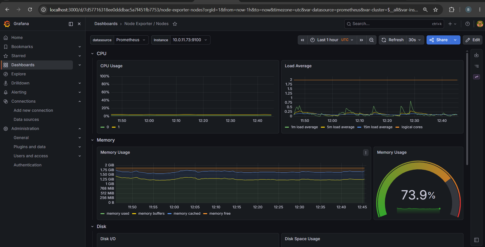
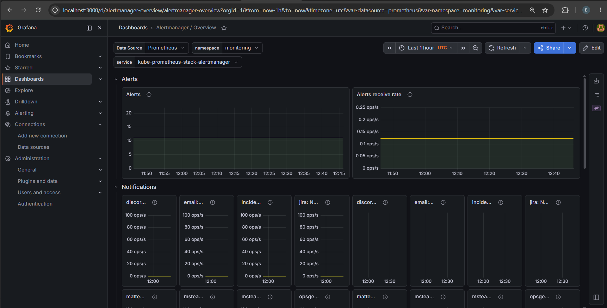
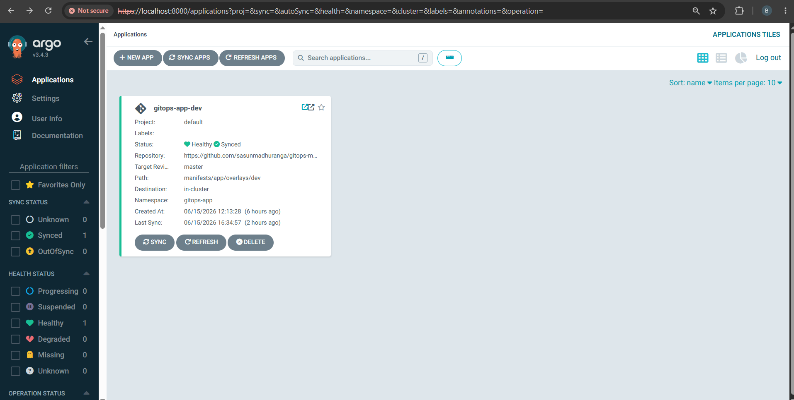
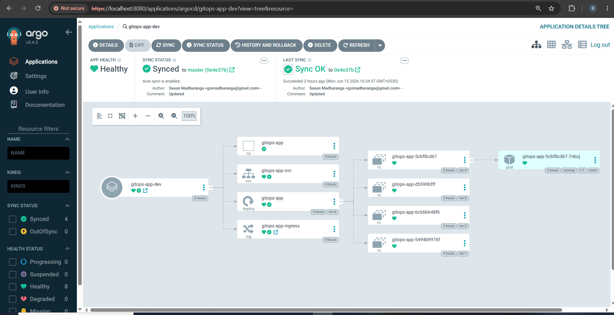
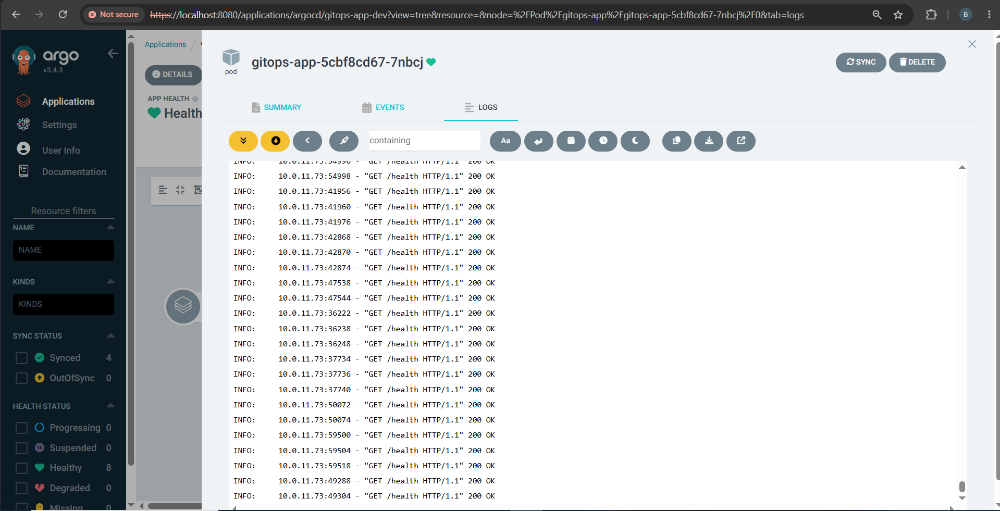
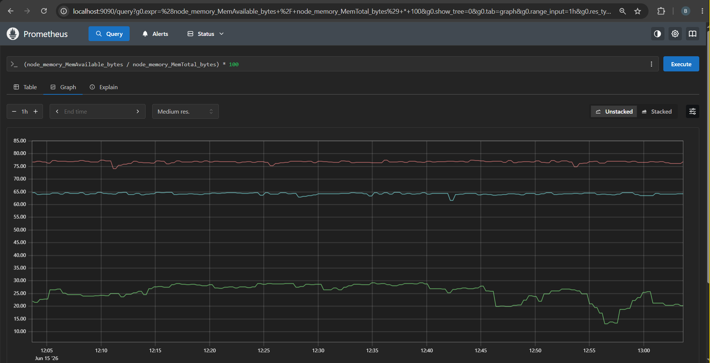
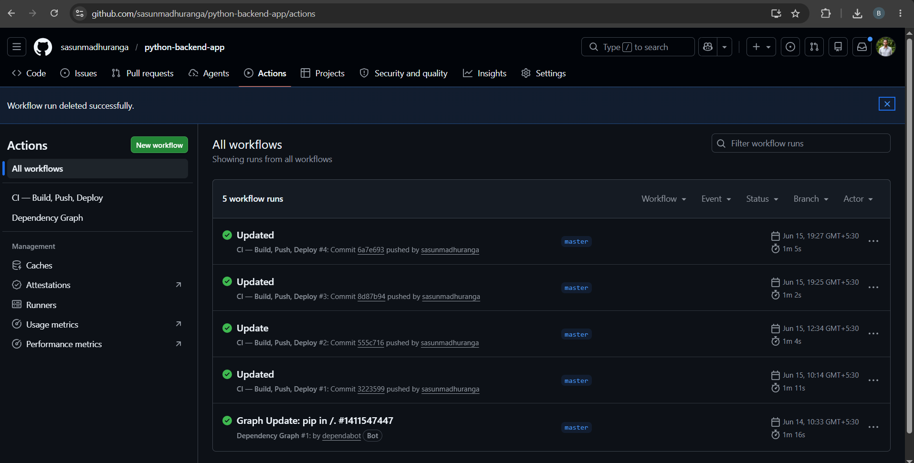

# gitops-manifests

Kubernetes manifests for the GitOps + ArgoCD on EKS project.
This is the **source of truth** for what is deployed to the cluster.
No one deploys manually, all changes go through Git.

## Structure

---

<p align="center">
    
</p>

---

## Repositories overview

This project uses 3 separate repos:

| Repo | Purpose | Who writes to it |
|---|---|---|
| `python-backend-app` | App source code + Dockerfile + GitHub Actions | Developer |
| `gitops-infra` | Terraform (VPC, EKS, ECR, IAM) | Developer (manual) |
| `gitops-manifests` (this repo) | K8s manifests — source of truth for cluster state | GitHub Actions (image tag) + Developer (config changes) |

## One-time setup

### 1. Replace placeholder values

In `manifests/app/overlays/dev/kustomization.yaml` and `overlays/prod/kustomization.yaml`:
- Replace ECR_URL with the actual ECR URL from `terraform output ecr_repository_url`

In `argocd/application.yaml` and `monitoring-apps.yaml`:
- Replace your GitHub username

In `manifests/monitoring/prometheus-stack-app.yaml` and `manifests/argocd-notifications/notifications-cm.yaml`:
- Replace gmail with your Gmail address
- Replace gmail with your gmail to receive alerts

### 2. Create Kubernetes secrets (before applying manifests)

These must be created manually. Never commit real credentials to Git:

```bash
# Grafana admin credentials
kubectl create secret generic grafana-admin-secret \
  --namespace monitoring \
  --from-literal=admin-user=admin \
  --from-literal=admin-password='YOUR_GRAFANA_PASSWORD'

# Gmail App Password for Alertmanager
# Get one at: https://myaccount.google.com/apppasswords
kubectl create secret generic gmail-password \
  --namespace monitoring \
  --from-literal=password='YOUR_GMAIL_APP_PASSWORD'

# Gmail App Password for ArgoCD Notifications
kubectl create secret generic argocd-notifications-secret \
  --namespace argocd \
  --from-literal=email-password='YOUR_GMAIL_APP_PASSWORD'

# App secret (Groq API key)
kubectl create secret generic gitops-app-secrets \
  --namespace gitops-app \
  --from-literal=GROQ_API_KEY='YOUR_GROQ_API_KEY'
```

### 3. Register the app with ArgoCD

```bash
# Make sure kubectl is pointing at your EKS cluster
aws eks update-kubeconfig --region us-east-1 --name gitops-argocd-dev-cluster

# Add gitops-manifests repo credentials (required if repo is private)
argocd repo add https://github.com/YOUR_GITHUB_USERNAME/gitops-manifests \
  --username YOUR_GITHUB_USERNAME \
  --password YOUR_GITHUB_PAT

# Apply the ArgoCD Application for your app
kubectl apply -f argocd/application.yaml

# Apply the monitoring ArgoCD Applications
kubectl apply -f monitoring-apps.yaml

# Watch ArgoCD sync in the UI
kubectl port-forward svc/argocd-server -n argocd 8080:443
# Open http://localhost:8080
```

### 4. Set up GitHub secrets in your app repo

Go to **python-backend-app** repo → Settings → Secrets and variables → Actions:

| Secret | Value |
|---|---|
| `AWS_ACCESS_KEY_ID` | IAM user access key with ECR push permissions |
| `AWS_SECRET_ACCESS_KEY` | IAM user secret key |
| `GITOPS_PAT` | GitHub PAT with `Contents: write` on this repo |

To create a fine-grained PAT:
GitHub → Settings → Developer settings → Personal access tokens → Fine-grained tokens → New token
- Repository access: only select `gitops-manifests`
- Permissions: Contents → Read and write

## How a deployment works

```
1. You push to master in python-backend-app
2. GitHub Actions builds Docker image → pushes to ECR with tag sha-<commit>
3. GitHub Actions checks out THIS repo
4. GitHub Actions updates newTag in overlays/dev/kustomization.yaml
5. GitHub Actions commits and pushes that single-line change
6. ArgoCD detects the new commit (polls every 3 min by default)
7. ArgoCD applies updated manifests to EKS cluster
8. Kubernetes performs a rolling update — zero downtime
9. Prometheus scrapes new pod metrics automatically
10. ArgoCD sends email notification on sync success
```

## Monitoring stack

The monitoring stack is also managed by ArgoCD (GitOps all the way down).

### What's installed

| Component | Namespace | Purpose |
|---|---|---|
| Prometheus | monitoring | Scrapes metrics from nodes, pods, ArgoCD |
| Grafana | monitoring | Dashboards for cluster and pipeline visibility |
| Alertmanager | monitoring | Sends email when alert rules fire |
| kube-state-metrics | monitoring | Exposes K8s object state |
| node-exporter | monitoring | Exposes raw node metrics |
| ArgoCD Notifications | argocd | Emails on sync success/failure/degraded |

### Pre-loaded Grafana dashboards

| Dashboard | ID | What it shows |
|---|---|---|
| ArgoCD | 14584 | Sync status, app health, operation history |
| Kubernetes Cluster | 7249 | Node count, pod count, resource usage |
| Kubernetes Pods | 6879 | Per-pod CPU and memory |
| Node Exporter Full | 1860 | Detailed node metrics |

### Alert rules

| Alert | Condition | Severity |
|---|---|---|
| ArgoCDAppOutOfSync | OutOfSync > 5 min | warning |
| ArgoCDAppSyncFailed | Sync phase = Failed | critical |
| ArgoCDAppDegraded | Health = Degraded > 5 min | critical |
| PodCrashLooping | Restart rate > 1/min | critical |
| PodNotReady | Not ready > 5 min | warning |
| NodeMemoryPressure | Free memory < 15% | warning |
| NodeHighCPU | CPU > 85% for 10 min | warning |
| NodeDiskPressure | Free disk < 20% | warning |

### Access monitoring UIs (port-forward)

Run each in a separate terminal and keep them open:

```bash
# ArgoCD → http://localhost:8080
kubectl port-forward svc/argocd-server -n argocd 8080:443

# Grafana → http://localhost:3000  (admin / your password)
kubectl port-forward svc/kube-prometheus-stack-grafana -n monitoring 3000:80

# Prometheus → http://localhost:9090
kubectl port-forward svc/kube-prometheus-stack-prometheus -n monitoring 9090:9090

# Alertmanager → http://localhost:9093
kubectl port-forward svc/kube-prometheus-stack-alertmanager -n monitoring 9093:9093
```

### Useful Prometheus queries

```promql
# App pod health
kube_pod_status_ready{namespace="gitops-app"}

# App CPU usage
rate(container_cpu_usage_seconds_total{namespace="gitops-app"}[5m])

# App memory usage
container_memory_usage_bytes{namespace="gitops-app"}

# ArgoCD sync status
argocd_app_info

# Node memory available %
(node_memory_MemAvailable_bytes / node_memory_MemTotal_bytes) * 100

# Pod restart count
kube_pod_container_status_restarts_total{namespace="gitops-app"}

# All firing alerts
ALERTS{alertstate="firing"}
```

## Rolling back a bad deploy

```bash
# Option 1: Revert the last commit (ArgoCD auto-syncs the rollback)
git revert HEAD
git push origin master

# Option 2: Set a specific previous image tag
# Edit overlays/dev/kustomization.yaml → change newTag to a previous sha-xxxxx
git commit -am "rollback: revert to sha-abc1234"
git push origin master

# Option 3: Rollback via ArgoCD UI
# ArgoCD → gitops-app-dev → History tab → click previous version → Rollback
```

## Node resource management (t3.small)

`t3.small` nodes have a pod limit of ~11 per node. If pods go Pending:

```bash
# Check total pod count
kubectl get pods -A --no-headers | wc -l

# Free up slots by scaling non-critical components
kubectl scale deployment aws-load-balancer-controller -n kube-system --replicas=1
kubectl scale deployment coredns -n kube-system --replicas=1

# Scale app to 1 replica for demo
kubectl scale deployment gitops-app -n gitops-app --replicas=1
```

## Teardown

```bash
# Delete K8s resources first (releases ALB and EBS volumes)
kubectl delete ingress --all -A
kubectl delete svc --all -n gitops-app

# Destroy all AWS infrastructure
cd gitops-infra
terraform destroy
```

---
## 📸 Screenshots
<p align="center">
    
    
    
    
    
    
    
    
</p>

---

## Author
Sasun Madhuranga

GitHub: https://github.com/sasunmadhuranga